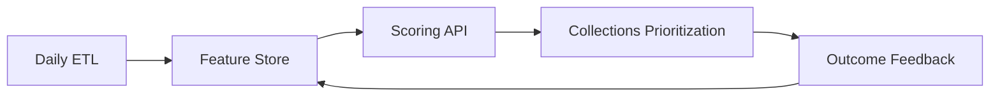

# Part 2: Predictive Modelling — Project Assessment & Completion Plan

**Document purpose:** Assess the current repository state and provide an actionable, end-to-end plan to complete Tasks 2.1–2.5 of the Senior Data Scientist assessment.

**Last updated:** 2026-05-24

---

## 1. Executive Summary

| Area | Status | Notes |
|------|--------|-------|
| Repository structure | **Strong** | Clear separation: `notebooks/`, `src/`, `reports/`, `docs/`, `tests/`, Docker |
| Data platform (ClickHouse) | **In progress / usable** | SQL marts defined; `02_eda` notebook queries `mart_customer_account_analytics` |
| Part 1 — EDA & storytelling | **Substantial** | `notebooks/02_eda_business_storytelling.ipynb` has charts, executive findings |
| Part 1 — Data understanding | **Substantial** | `notebooks/01_data_understanding.ipynb` explores Excel sheets & relationships |
| Part 2 — Segmentation (2.1) | **Scaffold only** | `04_customer_segmentation.ipynb` + `src/models/clustering/*` are stubs |
| Part 2 — Marketing (2.2) | **Scaffold only** | `05_marketing_strategy.ipynb` + `reports/.../marketing_strategy.md` empty |
| Part 2 — Deployment (2.3) | **Partial** | `Dockerfile`, commented API in `docker-compose.yml`, FastAPI skeleton; reports stub |
| Part 2 — Credit insights (2.4) | **Scaffold only** | `06_credit_risk_analysis.ipynb` + recommendations report empty |
| Part 2 — Risk strategy (2.5) | **Scaffold only** | `post_sale_risk_strategy.md` is a placeholder |
| Reusable Python modules | **Minimal** | Feature builders return 1–2 columns; pipelines not wired to real data |
| Tests | **Minimal** | Smoke tests only; no segmentation or risk integration tests |

**Bottom line:** The project has a professional scaffold and solid Part 1 momentum. Part 2 requires turning EDA insights and ClickHouse marts into completed analyses, business narratives, and (for 2.3) a credible deployment one-pager backed by the existing Docker/API skeleton.

**Recommended execution order:** 2.1 → 2.2 → 2.4 → 2.5 → 2.3 (deployment doc can be written in parallel with 2.4/2.5, but should reference the segmentation artifact from 2.1).

---

## 2. Current Project Assessment (Detail)

### 2.1 What is working well

1. **End-to-end data architecture intent**
   - Raw Excel → ClickHouse facts/dims → analytical marts (`src/sql/01–04_*.sql`).
   - `mart_customer_account_analytics` is the natural **customer grain** for segmentation and risk.

2. **EDA foundation for Part 2**
   - Notebook `02_eda_business_storytelling.ipynb` already surfaces:
     - QoQ sales by country
     - Installation delay anomalies (~63% negative delay — data/process flag)
     - Arrears by country & product tier
     - Lead-source mix
   - These findings should **inform feature engineering** and **segment profiling**, not be re-discovered.

3. **Deliverable locations are pre-defined**
   - Notebooks: `03` (features) → `04` (segmentation) → `05` (marketing) → `06` (credit) → `07` (evaluation).
   - Reports: `reports/business_reports/` and `reports/technical_reports/`.
   - Code: `src/features/`, `src/models/clustering/`, `src/deployment/`.

4. **Deployment bonus infrastructure exists**
   - `Dockerfile` (FastAPI + uvicorn)
   - `docker-compose.yml` (ClickHouse live; API service commented)
   - `src/deployment/api/`, monitoring stubs in `src/deployment/monitoring/`

### 2.2 Gaps to close for Part 2

| Gap | Impact | Resolution |
|-----|--------|------------|
| No customer-level modeling dataset persisted | Blocks reproducible 2.1–2.4 | Build `data/processed/customer_segmentation.parquet` from mart or Excel joins |
| Feature modules are placeholders | Weak 2.1 justification | Implement real features in `src/features/*`; call from nb `03` |
| Segmentation notebook empty | 2.1 not deliverable | Full pipeline in `04` + populate `segmentation_report.md` |
| No cluster labels stored | 2.2 cannot link to segments | Save `customer_id` + `segment_id` to `data/processed/` or `models/` |
| Business reports are 1-line stubs | Submission incomplete | Expand reports; cross-link notebook outputs |
| API not wired to models | 2.3/bonus weak | Optional: `/predict/segment` or `/score/risk` endpoints |
| Income variable likely absent | Limits “mid-to-high income” story for 2.2 | Use proxies: product tier, financed amount, repayment progress, arrears history |

### 2.3 Data assets & grain

**Source of truth (assessment dataset):**

- Excel: `data/raw/Senior_Data_Scientist_Assessment_Data*.xlsx` (gitignored; present locally)
- Sheets: Customers, Leads, Accounts, Sales, Installations, Products, Users, Departments

**Recommended modeling grain:** **One row per `customer_id`**, aggregated from Accounts (+ optional Leads/Sales/Installations).

**Primary mart (ClickHouse):**

```sql
-- Core fields available in mart_customer_account_analytics
customer_id, country_name, gender, age, age_bucket,
product_category, product_tier, account_status,
financed_amount, outstanding_balance, arrears_balance, days_past_due,
is_in_arrears, is_default, payment_type, repayment_progress, account_age_days
```

**Known data limitations (call out in 2.1d):**

- No direct income / employment / credit bureau fields → income must be **proxied**.
- Accounts table is snapshot-oriented; limited payment **history** (no month-by-month ledger in provided data).
- Installation delay anomalies suggest **date alignment** issues between Sales and Installations.
- Multi-account customers possible → aggregation rules must be documented.
- Geographic coords exist on Customers but may be sparse/noisy for clustering at scale.
- Class imbalance for default (`is_default`) if used for supervised risk (2.4/2.5); segmentation is unsupervised (2.1).

---

## 3. Cross-Cutting Standards (Apply to All Part 2 Tasks)

### 3.1 Reproducibility checklist

- [ ] Pin random seeds (`random_state=42`) for clustering and train/test splits.
- [ ] Log package versions in notebook first cell (`pandas`, `sklearn`, etc.).
- [ ] Save intermediate tables to `data/processed/` with README note in commit message (not the data files themselves if gitignored).
- [ ] Document join logic in `docs/assumptions.md` (update, don’t create duplicate docs).

### 3.2 Visualization & narrative standards

- Reuse dark-theme palette from notebook `02` for consistency.
- Every chart: **title, axis labels, n= sample size, date/snapshot caveat**.
- Every segment profile: **size (%), 3–5 defining traits, business name** (e.g. “Stable Growers”, not “Cluster 2”).

### 3.3 Code vs notebook split

| Logic | Location |
|-------|----------|
| Feature definitions | `src/features/segmentation_features.py`, `customer_features.py`, `risk_features.py` |
| Clustering fit, metrics | `src/models/clustering/kmeans.py`, `evaluation.py`, `profiling.py` |
| Orchestration | `src/models/pipelines/segmentation_pipeline.py` |
| Exploration, charts, narrative | Notebooks `03`–`07` |
| Executive write-ups | `reports/business_reports/*.md`, `reports/technical_reports/*.md` |

---

## 4. Task 2.1 — Customer Segmentation & Profiling

### 4.1 Objective

Produce defensible customer segments using engineered features and unsupervised learning; profile each segment in business language.

### 4.2 Deliverables

| Deliverable | Path |
|-------------|------|
| Feature engineering notebook | `notebooks/03_feature_engineering.ipynb` |
| Segmentation analysis notebook | `notebooks/04_customer_segmentation.ipynb` |
| Segment profiles table + narrative | `reports/business_reports/segmentation_report.md` |
| Serialized model + customer labels | `models/segmentation/kmeans_model.joblib`, `data/processed/customer_segments.parquet` |
| Unit tests (optional but strong) | `tests/test_feature_engineering.py`, extend clustering tests |

### 4.3 Step-by-step plan

#### Phase A — Build the customer modeling dataset (Notebook 03 + `src/data/joins.py`)

1. **Load data** via ClickHouse mart *or* Excel joins (prefer mart for consistency with EDA).
2. **Aggregate to customer level** if multiple accounts per customer:
   - `financed_amount`: sum or max (document choice)
   - `outstanding_balance`, `arrears_balance`: sum
   - `days_past_due`: max
   - `is_in_arrears`, `is_default`: max (any account in distress flags customer)
   - `repayment_progress`: weighted mean by outstanding balance
   - `account_age_days`: max
   - `product_tier`: mode or highest tier ordinal
   - `payment_type`: mode
   - `country_name`: first (should be unique per customer)
3. **Filter scope** for segmentation:
   - Include all countries for global segmentation **or**
   - Kenya-only slice for marketing alignment (recommended: **global segmentation**, Kenya filter for 2.2 selection).
4. **Export** `data/processed/customer_features_base.parquet`.

#### Phase B — Feature engineering (justify each feature)

Implement in `src/features/segmentation_features.py` (and call from notebook 03).

| Feature | Formula / logic | Business justification |
|---------|-----------------|------------------------|
| `age` / `age_bucket` | From DOB | Life-stage & product fit |
| `account_age_days` | From mart | Tenure / relationship maturity |
| `financed_amount_log` | `log1p(financed_amount)` | Scale skew; proxy exposure |
| `outstanding_to_financed` | outstanding / financed | Leverage / remaining obligation |
| `repayment_progress` | From mart | Payment discipline |
| `arrears_rate` | arrears / outstanding (cap) | Current stress |
| `days_past_due_cap` | min(dpd, 90) | Non-linear delinquency severity |
| `is_in_arrears`, `is_default` | Binary | Risk state |
| `product_tier_ord` | Ordinal encode tier | Product affluence proxy |
| `payment_type_enc` | One-hot or ordinal PAYG vs cash | Behavioral payment mode |
| `lead_conversion_speed` | days_to_sale from funnel (if joined) | Acquisition quality |
| `installation_delay_days` | install − sale (if joined) | Operational experience |
| `lead_quality_score` | From funnel | Pre-sale quality signal |
| RFM-style (if derivable) | Recency of last activity proxy via account_age + arrears flags | Classic segmentation axes |

**Preprocessing pipeline:**

- Impute numeric: median by `country_name` (not global).
- Impute categorical: `"Unknown"`.
- Scale: `StandardScaler` or `RobustScaler` (justify: Robust if heavy tails on amounts).
- Encode categoricals: `OneHotEncoder` with `handle_unknown='ignore'`.

Document exclusions: customer_id, raw dates, free-text.

#### Phase C — Algorithm selection & implementation (Notebook 04)

**Recommended primary algorithm: K-Means** on scaled numeric + encoded categorical features.

| Criterion | K-Means | GMM | Hierarchical | DBSCAN |
|-----------|---------|-----|--------------|--------|
| Interpretability for business | High | Medium | Medium | Low |
| Scales to ~15k customers | Yes | Yes | Slow | Yes |
| Assumes spherical clusters | Yes (limitation) | No (advantage) | No | Arbitrary shapes |
| Fixed k for marketing | Easy | Easy | Easy | Hard (noise) |

**Justification text for report (2.1b):**

> We use K-Means because (1) the marketing use case requires a fixed, interpretable set of personas; (2) our feature space is moderate-dimensional after encoding; (3) cluster centroids are easy to explain to non-technical stakeholders. We validate robustness with silhouette scores and consider GMM as a sensitivity check if clusters overlap heavily.

**Implementation:**

- Use `src/models/clustering/kmeans.py` — already wraps `KMeans(random_state=42, n_init='auto')`.
- Optional sensitivity: `GaussianMixture` with same k; compare ARI between label assignments.

**Optional:** Run `DBSCAN` in appendix only — likely many noise points with mixed-scale financial data unless carefully tuned.

#### Phase D — Optimal number of clusters (2.1c)

Use **multiple methods** and converge on k with business interpretability:

1. **Elbow method** — inertia vs k (k = 2..10).
2. **Silhouette score** — average silhouette vs k (`src/models/clustering/evaluation.py`).
3. **Calinski-Harabasz** (bonus).
4. **Business constraint** — k should yield segments with **minimum size ≥ 5%** of base (avoid micro-segments).
5. **Stability check** — refit on 80% bootstrap; measure adjusted Rand index across runs.

**Document final k** (expected range: **4–6** based on blueprint) with one paragraph reconciling metrics vs interpretability.

#### Phase E — Segment profiling (2.1 — profiling section)

For each cluster `k`:

1. **Size:** count and % of customers (and % of total outstanding balance).
2. **Means/medians** vs overall population for top 8 features.
3. **Categorical modes:** country mix, payment_type, product_tier, gender, age_bucket.
4. **Risk view:** arrears rate, default rate, avg DPD.
5. **Business persona** — 4–6 sentence narrative + suggested label.

Use `src/models/clustering/profiling.py` — extend to include:
- `pct_of_total`
- comparison to global mean (lift)
- export markdown-friendly table

**Populate** `reports/business_reports/segmentation_report.md` with:
- Methodology summary
- Feature justification table
- k selection plots (embedded or referenced from notebook)
- Segment cards (one subsection per segment)
- Limitations (2.1d)

#### Phase F — Dataset limitations (2.1d) — required paragraph topics

- Absence of income → proxies only for premium loan targeting.
- Snapshot bias (no full repayment timeline).
- Date quality (installation delays).
- Aggregation hides account-level heterogeneity.
- Unsupervised segments optimize separation, not profitability or causal response.

### 4.4 Acceptance criteria for 2.1

- [ ] ≥ 8 engineered features with written justification.
- [ ] Algorithm named, implemented, and justified.
- [ ] k selection shown with ≥ 2 quantitative diagnostics.
- [ ] ≥ 4 segments profiled with business narratives.
- [ ] Limitations section explicit and honest.
- [ ] `customer_segments.parquet` enables downstream 2.2.

---

## 5. Task 2.2 — Data-Driven Marketing Strategy (Kenya Premium Loan)

### 5.1 Objective

Select two segments best suited for a **premium loan** in Kenya (stable, mid-to-high income proxy); propose message + channel per segment.

### 5.2 Deliverables

| Deliverable | Path |
|-------------|------|
| Marketing notebook | `notebooks/05_marketing_strategy.ipynb` |
| Strategy write-up | `reports/business_reports/marketing_strategy.md` |

### 5.3 Segment selection framework

**Product requirements (from brief):**

- Stable repayment behavior
- Mid-to-high income (proxy)
- Kenya geography
- Worth limited marketing budget (concentrated ROI)

**Scoring rubric (weighted):**

| Criterion | Proxy in data | Weight |
|-----------|---------------|--------|
| Stability | Low `is_in_arrears`, low `days_past_due`, high `repayment_progress` | 35% |
| Affluence proxy | High `product_tier`, high `financed_amount`, PAYG vs cash mix | 25% |
| Growth potential | Moderate `outstanding_to_financed`, tenure not brand-new | 15% |
| Segment size | Enough reachable customers | 15% |
| Low default risk | Low `is_default` rate | 10% |

**Steps:**

1. Filter `customer_segments.parquet` to `country_name == 'Kenya'` (or `kenya`).
2. Compute segment-level KPIs on rubric.
3. Rank segments; select **top 2** with written tie-break rules.
4. Explicitly state why **rejected** segments fail (e.g. high arrears, small size, young volatile tenure).

### 5.4 Messaging & channel templates (fill per selected segment)

For each of the two segments document:

**a) Marketing message**

- Headline (≤ 12 words)
- Value proposition tied to segment trait (stability, upgrade, asset building)
- CTA (apply / speak to agent / USSD)
- Tone (formal vs aspirational) matched to age/product tier

**b) Channel strategy**

| Segment archetype (example) | Channels | Rationale |
|----------------------------|----------|-----------|
| Stable PAYG upgraders | SMS + field agent + WhatsApp | Already on payment rails; agent trust for loan upsell |
| High-tier cash growers | Outbound call + regional events | Higher touch; financing for expansion |

Reference Kenya context: mobile money, agent networks, seasonal agriculture income.

**c) Justification linkage**

Table mapping segment metrics → product requirement → tactic.

### 5.5 Acceptance criteria for 2.2

- [ ] Exactly two segments named with Kenya filter applied.
- [ ] Message + channel for each.
- [ ] Every recommendation cites ≥ 2 segment statistics from 2.1.
- [ ] Budget rationale: why these two maximize reach × conversion × low risk.

---

## 6. Task 2.3 — Model Deployment & Lifecycle Management (One-Pager)

### 6.1 Objective

Demonstrate production thinking: packaging, deployment, monitoring, retraining, human override — not necessarily full production implementation.

### 6.2 Deliverable

| Deliverable | Path |
|-------------|------|
| One-pager (primary) | `reports/technical_reports/deployment_strategy.md` |
| Optional deep-dive | `docs/architecture.md` (update deployment section) |
| Bonus: working API | Uncomment `api` in `docker-compose.yml`; wire `/api/score` |

### 6.3 One-pager outline (write to deployment_strategy.md)

Use the following headings verbatim for assessor alignment:

#### 1. Model Packaging & Deployment Choices

- **Package format:** `joblib`/`pickle` for sklearn K-Means + `sklearn.pipeline.Pipeline` (preprocessor + model); version in filename (`kmeans_v1.2.0.joblib`).
- **Metadata sidecar:** `model_card.json` — training date, features, k, data snapshot hash, metrics.
- **Preferred strategy:** **Containerized REST API** (FastAPI) behind load balancer.
  - *Why:* Language-native team, low latency for batch scoring, easy CI/CD, works on AWS ECS / Azure Container Apps / GKE.
- **Alternatives mentioned:** Batch scoring in ClickHouse/dbt (nightly segment refresh); serverless (Lambda) for infrequent retrains.

**Sample Dockerfile** — reference existing root `Dockerfile` (already valid).

**Sample docker-compose** — extend current file:

```yaml
# Illustrative addition (uncomment and adapt in repo)
services:
  api:
    build: .
    ports:
      - "8000:8000"
    environment:
      - MODEL_PATH=/app/models/segmentation/kmeans_model.joblib
    depends_on:
      - clickhouse
    volumes:
      - ./models:/app/models:ro
```

#### 2. Collaboration with DevOps / Engineering

| Activity | DS ownership | Platform ownership |
|----------|--------------|-------------------|
| Dockerfile / health checks | Define | Harden, scan |
| CI/CD pipeline | Tests + training job | Runners, secrets |
| Infra (CPU/mem, autoscale) | SLA requirements | Provisioning |
| Observability | Metric definitions | Prometheus/Grafana/CloudWatch |
| Secrets | — | Vault / Key Vault |
| Release | Model card sign-off | Deploy to staging → prod |

**Monitoring hooks:** reuse stubs in `src/deployment/monitoring/metrics.py`, `drift_detection.py`, `alerts.py` — describe intended implementation (PSI on features, segment size drift, API latency).

#### 3. Model Maintenance & Iteration

| Signal | Threshold example | Action |
|--------|-------------------|--------|
| Population Stability Index | PSI > 0.2 on key feature | Investigate; retrain |
| Segment size shift | > 15% change in 30d | Review macro/market |
| Silhouette drop on refresh | > 10% relative drop | Revisit k/features |
| Business KPI | Campaign conversion drop | Segment remap |

**Retrain cadence:** quarterly scheduled + event-triggered (product launch, regulatory change).

**CI/CD for models:**

```
PR → unit tests → train on snapshot → evaluate vs champion →
register artifact → deploy to staging → integration test →
manual approval → prod deploy
```

Tools to mention (if used): GitHub Actions, MLflow, DVC, Azure ML, AWS SageMaker — pick what you have experience with; honesty preferred.

#### 4. Handling Business Conflicts & Overrides

- **Policy layer:** model score is advisory; credit officers can override with reason code.
- **Logging:** store `{customer_id, model_score, segment_id, human_decision, reason, timestamp}` in audit table.
- **Feedback loop:** monthly extract overrides → label quality analysis → feature refinement (not blind retraining on overrides).
- **Governance:** dual approval for threshold changes; disparate impact review on segment definitions.

### 6.4 Acceptance criteria for 2.3

- [ ] All four bullet areas from brief covered in ≤ ~2 pages.
- [ ] Dockerfile + compose example included (can reference repo files).
- [ ] Monitoring and retrain triggers are specific, not generic.
- [ ] Human override workflow is explicit.

---

## 7. Task 2.4 — Credit Risk Mitigation Analysis

### 7.1 Objective

≥ 3 actionable, **specific, measurable, practical** recommendations using **only** the provided dataset.

### 7.2 Deliverables

| Deliverable | Path |
|-------------|------|
| Analysis notebook | `notebooks/06_credit_risk_analysis.ipynb` |
| Recommendations report | `reports/business_reports/credit_risk_recommendations.md` |

### 7.3 Analysis plan (derive insights from data, not generic best practices)

Run analyses that mirror EDA but sharpen to **collections actions**:

| Analysis | Hypothesis | Possible action |
|----------|------------|-----------------|
| Arrears × `days_past_due` × `payment_type` | PAYG accounts may delinqu differently | Early SMS at DPD 7 for PAYG |
| Arrears × `product_tier` × country | Tier-country combos are hot spots | Tier-specific payment plans |
| `repayment_progress` deciles vs default | Low progress predicts default | Proactive outreach < 30% progress at 90 days |
| Lead source × arrears (join funnel) | Bad acquisition channels | Shift marketing $ away from high-arrears sources |
| Installation delay × arrears | Ops friction → payment stress | Fix install delays in worst quartile regions |
| Account age × arrears | Early-life delinquency | First-90-day welcome + payment education |
| Gender/age (careful framing) | Demographic risk pattern | Targeted financial literacy (avoid discriminatory pricing) |

**Each recommendation must follow SMART format:**

1. **Action** — what collections/marketing/ops does.
2. **Segment/filter** — explicit rule (SQL-like).
3. **Metric** — baseline from notebook (% in arrears, n customers).
4. **Target** — e.g. reduce arrears rate by 2 pp in 6 months.
5. **Implementation note** — owner, channel, frequency.

### 7.4 Example recommendation skeleton (replace with your numbers)

> **R1 — Early intervention for Kenya PAYG accounts with DPD ≥ 7**  
> *Filter:* `country = Kenya AND payment_type = PAYG AND days_past_due >= 7 AND is_in_arrears = 1`  
> *Baseline:* X% of PAYG accounts in arrears (n=N).  
> *Action:* Automated SMS + agent callback within 48h.  
> *Target:* Reduce 30+ DPD roll-forward by 15% in Q3.  
> *Measure:* Weekly roll-rate from `days_past_due` distribution.

### 7.5 Acceptance criteria for 2.4

- [ ] ≥ 3 recommendations, each with filter, baseline, action, metric.
- [ ] All quantified numbers traceable to notebook cells.
- [ ] Uses only provided dataset (document joins).
- [ ] Focus on collection rate / default risk reduction.

---

## 8. Task 2.5 — Strategic Proposal: Post-Sale Credit Risk Scoring Model

### 8.1 Objective

1–2 page forward-looking proposal for **early default detection** post-sale.

### 8.2 Deliverable

`reports/business_reports/post_sale_risk_strategy.md` (expand from placeholder)

### 8.3 Required sections (template)

#### 1. Business Problem (½ page)

- Default definition (`is_default`, DPD thresholds).
- Impact: write-offs, cash flow, agent capacity, portfolio growth constraints in Kenya/Uganda/CIV.
- Link to EDA finding (e.g. arrears variance by tier/country).

#### 2. Proposed Solution (¼ page)

- Post-sale risk score (0–100) at account/month level.
- Triggers: collections queue priority, treatment pathway (soft vs hard), restructuring eligibility.
- Integration points: CRM, collections dialer, ClickHouse feature store.

#### 3. Data & Features (3–5 **new** external/enriched sources)

| Source | Examples | Why critical |
|--------|----------|--------------|
| Repayment ledger | Daily installments, partial payments | Early behavioral signal |
| Mobile money / wallet | M-Pesa in/out flows | Real income volatility |
| Credit bureau | CRB Kenya score | External credit history |
| Customer support | Tickets, complaints | Distress before missed payment |
| IoT / device telemetry | Pump usage hours | Product utilization → ability/willingness to pay |
| Macro/agronomy | Rainfall, crop prices | Seasonal income shock |

#### 4. Methodology (high level)

- Problem type: binary classification (90-day default) or survival (time-to-default).
- Models: logistic baseline → gradient boosting (XGBoost/LightGBM) → calibration (Platt/isotonic).
- Validation: time-based split (no leakage), metric: AUC-PR + recall@top decile + business lift.
- Workflow integration diagram (text or mermaid):



#### 5. Success Metrics

| Metric | Definition |
|--------|------------|
| Default rate | % accounts hitting default flag |
| Collections efficiency | $ collected / agent hour |
| Roll rate | DPD 30→60→90 |
| Precision@K | % true defaults in top K% scores |
| Cost savings | Reduced write-offs − program cost |

#### 6. Next Steps — POC plan (90 days)

| Week | Activity |
|------|----------|
| 1–2 | Data audit; label definition; join repayment history |
| 3–4 | Feature spec; baseline logistic; leakage checks |
| 5–6 | GBM model; SHAP interpretability for collections agents |
| 7–8 | Backtest on holdout quarter; policy simulation |
| 9–10 | Pilot with collections team (A/B on prioritization) |
| 11–12 | Executive readout; production roadmap |

Stakeholders: Head of Credit, Collections Ops, Data Engineering, Country GMs.

### 8.4 Acceptance criteria for 2.5

- [ ] 1–2 pages, all 6 sections present.
- [ ] 3–5 new data sources named with rationale.
- [ ] Clear connection to collections workflow.
- [ ] POC steps are concrete and time-boxed.

---

## 9. Implementation Schedule (Suggested)

| Week | Focus | Outputs |
|------|-------|---------|
| 1 | Customer mart → features (`03`) | `customer_features_base.parquet`, updated `segmentation_features.py` |
| 1–2 | Segmentation (`04`) + report 2.1 | `customer_segments.parquet`, `segmentation_report.md` |
| 2 | Marketing (`05`) + report 2.2 | `marketing_strategy.md` |
| 2 | Credit analysis (`06`) + report 2.4 | `credit_risk_recommendations.md` |
| 3 | Risk proposal 2.5 + deployment 2.3 | `post_sale_risk_strategy.md`, `deployment_strategy.md` |
| 3 | Evaluation (`07`), tests, polish | README links, optional API wire-up |

**Parallel track:** Update `docs/assumptions.md` and `docs/methodology.md` as decisions are made (aggregation rules, k, proxies).

---

## 10. File Change Map (Quick Reference)

| Action | File |
|--------|------|
| Implement features | `src/features/segmentation_features.py`, `risk_features.py`, `customer_features.py` |
| Customer-level joins | `src/data/joins.py` |
| Cluster + evaluate | `src/models/clustering/*.py`, `segmentation_pipeline.py` |
| Notebooks (execute in order) | `03` → `04` → `05` → `06` → `07` |
| Business reports | `reports/business_reports/segmentation_report.md`, `marketing_strategy.md`, `credit_risk_recommendations.md`, `post_sale_risk_strategy.md` |
| Technical report | `reports/technical_reports/deployment_strategy.md` |
| Optional API | `src/deployment/api/routes.py`, `schemas.py`, `docker-compose.yml` |
| Assumptions log | `docs/assumptions.md` |
| Methodology log | `docs/methodology.md` |

---

## 11. Submission Quality Checklist (Part 2 Complete)

- [ ] **2.1** Features justified; K-Means (or alternative) implemented; k selection documented; limitations honest; segments profiled.
- [ ] **2.2** Two Kenya segments chosen; message + channel each; linked to 2.1 stats.
- [ ] **2.3** One-pager covers packaging, DevOps collaboration, monitoring/retrain, overrides; Docker examples included.
- [ ] **2.4** ≥ 3 SMART recommendations with baselines from data.
- [ ] **2.5** 1–2 page strategy with all six sections + POC timeline.
- [ ] Notebooks run end-to-end without manual path hacks (use `src/config/paths.py`).
- [ ] Reports are substantive (not placeholder sentences).
- [ ] Optional bonus: API scores customers; monitoring section names tools.

---

## 12. Relationship to Existing Artifacts

| Existing artifact | How to use it in Part 2 |
|-------------------|-------------------------|
| `notebooks/02_eda_business_storytelling.ipynb` | Source of baselines (arrears, delays, lead mix); cite in 2.4/2.5 |
| `docs/story_telling_blueprint.md` | Segment variables ideas (§C); narrative tone |
| `mart_customer_account_analytics` | Primary feature source for 2.1/2.4 |
| `src/models/risk/train.py` | Optional supervised baseline for 2.5 methodology |
| `Dockerfile` / `docker-compose.yml` | Core of 2.3 deployment answer |
| `reports/technical_reports/monitoring_strategy.md` | Expand into 2.3 monitoring subsection |

---

## 13. Open Decisions (Resolve Before Coding 2.1)

Record answers in `docs/assumptions.md`:

1. **Segmentation universe:** All countries vs Kenya-only for clustering?
2. **Multi-account customers:** Sum vs max vs “worst account” aggregation?
3. **Snapshot date:** Is accounts data a single snapshot or multiple? (Affects recency features.)
4. **Income proxy definition:** Which single rule for “mid-to-high income” in 2.2?
5. **Default label:** Use `is_default` only or composite `days_past_due > X`?

---

*This plan is the authoritative guide for completing Part 2. Update section checkboxes as tasks are completed.*
