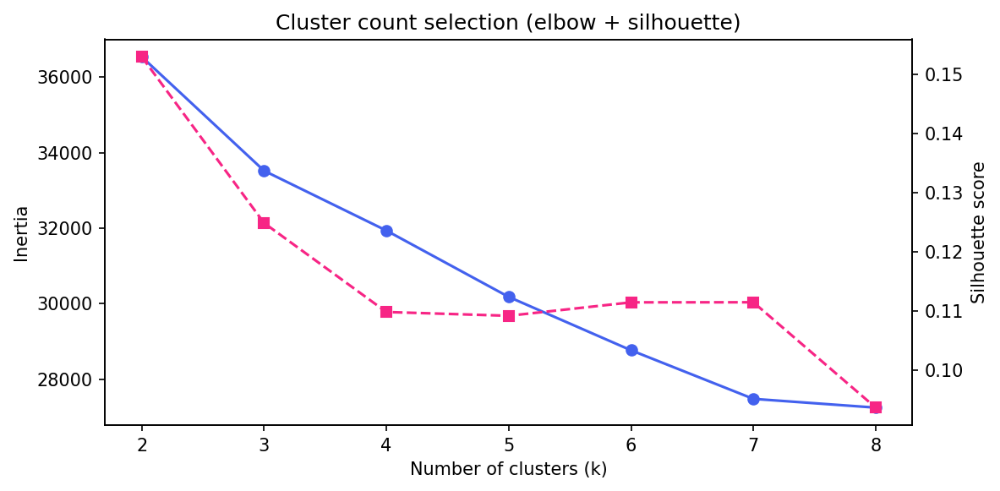

# Customer Segmentation Report

## 1. Executive Summary

We segmented **4,750 customers** with active accounts into **6 clusters** using K-Means on engineered behavioral, demographic, and risk-proxy features. Segments are named for business use in marketing and collections planning.

## 2. Data Preparation & Feature Engineering

Customer grain: one row per `customer_id` from Accounts joined to Customers, Products, Sales, Installations, and Leads. Financial balances are **proxied** from account status, payment type, and product tier because the source extract does not include ledger balances.

| Feature | Rationale |
|---------|-----------|
| `age` | Life-stage influences product fit and repayment capacity. |
| `account_age_days` | Tenure reflects relationship maturity and observed payment history length. |
| `financed_amount_log` | Log-scaled exposure proxy; reduces skew from product/pricing tiers. |
| `outstanding_to_financed` | Leverage remaining on the account. |
| `repayment_progress` | Payment discipline signal (derived from balance proxies). |
| `arrears_rate` | Current financial stress on outstanding balance. |
| `days_past_due_cap` | Delinquency severity (capped for stability). |
| `lead_conversion_speed` | Faster conversion often correlates with intent and channel quality. |
| `installation_delay_days` | Operational friction may precede payment stress. |
| `lead_quality_score` | Historical health rate by lead source (acquisition quality). |
| `recency_score` | RFM-style engagement proxy. |
| `frequency_score` | Multi-account / repeat relationship proxy. |
| `monetary_score` | Relative financed exposure within portfolio. |
| `risk_stress_score` | Composite arrears/default/delinquency signal. |
| `country_name` | Regional market and macro context (Kenya/Uganda/CIV). |
| `gender` | Demographic profile dimension. |
| `payment_type` | PAYG vs CASH captures financing behavior. |
| `product_tier` | New vs refurbished proxies product/affluence segment. |
| `lead_source` | Acquisition channel quality differs materially. |

## 3. Model Selection & Implementation

### 3a. Algorithm: K-Means

K-Means was selected because marketing and credit stakeholders need a **fixed, interpretable set of personas**, centroids are easy to explain, and runtime scales to the full portfolio. Gaussian Mixture Models were considered for overlapping clusters but deprioritized for interpretability.

### 3b. Optimal cluster count

| k | Silhouette | Min cluster % | Inertia |
|---|------------|---------------|---------|
| 2 | 0.153 | 38.1% | 36540 |
| 3 | 0.125 | 29.7% | 33523 |
| 4 | 0.110 | 16.7% | 31939 |
| 5 | 0.109 | 16.9% | 30183 |
| 6 | 0.111 | 13.5% | 28769 |
| 7 | 0.111 | 8.9% | 27483 |
| 8 | 0.094 | 8.5% | 27251 |

**Selected k = 6** — highest silhouette among solutions where every segment represents at least ~5% of customers (business interpretability constraint).

### 3c. Dataset limitations

- **No income or bureau data** — affluence inferred from product tier and financing proxies only.
- **Snapshot accounts data** — no monthly repayment ledger; `repayment_progress` and balances are modeled proxies.
- **Installation date anomalies** — negative sale-to-install delays indicate data/process issues.
- **Unsupervised segments** optimize statistical separation, not campaign ROI or causality.
- **250 customers** without linked accounts are excluded from clustering.

## 4. Segment Profiles

### Segment 0: Reliable Mid-Tier

- **Size:** 643 customers (13.5% of portfolio)
- **Countries:** {'Kenya': 215, "Côte d'Ivoire": 214, 'Uganda': 214}
- **Payment mix:** {'CASH': 324, 'PAYG': 319}
- **Avg repayment progress:** 0.64
- **Arrears rate:** 15.2%
- **Default rate:** 0.0%
- **Avg financed (proxy):** 65,117
- **Avg account age (days):** 351

**Persona:** Solid payers with moderate tenure; good cross-sell potential with light-touch digital channels.

### Segment 1: Distressed Defaulters

- **Size:** 642 customers (13.5% of portfolio)
- **Countries:** {"Côte d'Ivoire": 218, 'Uganda': 214, 'Kenya': 210}
- **Payment mix:** {'CASH': 329, 'PAYG': 313}
- **Avg repayment progress:** 0.20
- **Arrears rate:** 27.3%
- **Default rate:** 72.7%
- **Avg financed (proxy):** 65,374
- **Avg account age (days):** 448

**Persona:** Customers with elevated write-off/repossession statuses and weak repayment proxies. Prioritize collections and workout—not premium upsell.

### Segment 2: Distressed Defaulters

- **Size:** 976 customers (20.5% of portfolio)
- **Countries:** {'Kenya': 336, "Côte d'Ivoire": 322, 'Uganda': 318}
- **Payment mix:** {'PAYG': 492, 'CASH': 484}
- **Avg repayment progress:** 0.10
- **Arrears rate:** 0.0%
- **Default rate:** 100.0%
- **Avg financed (proxy):** 194,631
- **Avg account age (days):** 426

**Persona:** Customers with elevated write-off/repossession statuses and weak repayment proxies. Prioritize collections and workout—not premium upsell.

### Segment 3: Stable Premium Growers

- **Size:** 791 customers (16.7% of portfolio)
- **Countries:** {'Uganda': 274, "Côte d'Ivoire": 263, 'Kenya': 254}
- **Payment mix:** {'CASH': 421, 'PAYG': 370}
- **Avg repayment progress:** 0.80
- **Arrears rate:** 0.0%
- **Default rate:** 0.0%
- **Avg financed (proxy):** 197,901
- **Avg account age (days):** 376

**Persona:** Strong repayment progress and higher financed exposure—prime candidates for premium loan and loyalty offers.

### Segment 4: Arrears-Stressed PAYG

- **Size:** 986 customers (20.8% of portfolio)
- **Countries:** {"Côte d'Ivoire": 351, 'Uganda': 321, 'Kenya': 314}
- **Payment mix:** {'CASH': 524, 'PAYG': 462}
- **Avg repayment progress:** 0.45
- **Arrears rate:** 67.3%
- **Default rate:** 0.0%
- **Avg financed (proxy):** 197,830
- **Avg account age (days):** 417

**Persona:** PAYG-heavy segment with active arrears flags. Needs payment plans and proactive outreach.

### Segment 5: Distressed Defaulters

- **Size:** 712 customers (15.0% of portfolio)
- **Countries:** {"Côte d'Ivoire": 246, 'Uganda': 246, 'Kenya': 220}
- **Payment mix:** {'PAYG': 379, 'CASH': 333}
- **Avg repayment progress:** 0.28
- **Arrears rate:** 29.2%
- **Default rate:** 51.5%
- **Avg financed (proxy):** 159,733
- **Avg account age (days):** 119

**Persona:** Customers with elevated write-off/repossession statuses and weak repayment proxies. Prioritize collections and workout—not premium upsell.
