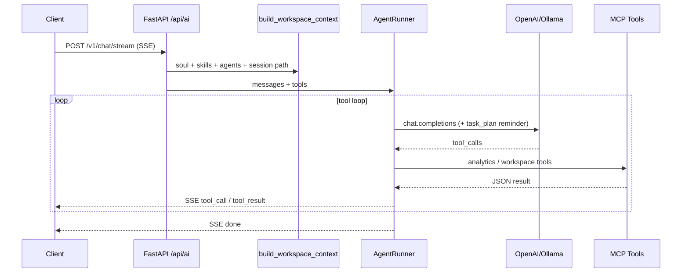

# AI Platform Architecture (OpenClaw-style)

Aligned with Cropnuts `backend/workspace` + `backend/api/live.py` + `mcp_host` + `core/agents/runner.py`.

## Flow



## Workspace layout (`workspace/`)

| Path | Role |
|------|------|
| `AGENTS.md`, `IDENTITY.md`, `USER.md`, `SOUL.md`, … | Soul / bootstrap context |
| `agents/*.md` | Agent definitions (YAML frontmatter) |
| `skills/*/SKILL.md` | Invocable skills (YAML frontmatter) |
| `knowledge/*.md` | Domain reference |
| `document_structure/*.md` | Report outline templates |
| `sessions/{id}/workspace/` | Per-chat `task_plan.md`, `findings.md`, `progress.md` |
| `sessions/sessions.json` | Session registry |

## Code layout

| Path | Role |
|------|------|
| `api/live.py` | SSE endpoint |
| `api/context.py` | System prompt + MCP schemas + `SessionManager` |
| `prompt_templates/system.py` | Core instructions + `build_workspace_context()` |
| `workspace/loader.py` | Soul, agents, knowledge, doc structures |
| `workspace/skill_loader.py` | `SKILL.md` discovery → XML for prompt |
| `core/agents/runner.py` | Tool loop, task-plan injection |
| `core/session.py` | OpenClaw session folders |
| `mcp/_instance.py` | Shared FastMCP instance |
| `mcp/analytics_tools.py` | Portfolio / segment / report tools |
| `mcp/workspace_tools.py` | Skills, agents, knowledge, session tree |
| `data_access.py` | Parquet / ClickHouse |

## MCP tools

**Analytics:** `get_portfolio_kpis`, `query_customers`, `list_customer_segments`, `predict_customer_segment`, `read_business_report`, `run_clickhouse_select`, `read_file`

**Workspace:** `list_skills`, `read_skill`, `list_agents`, `read_agent`, `list_knowledge`, `read_knowledge`, `list_document_structures`, `read_document_structure`, `get_session_folder_structure`, `get_workspace_structure`

**Charts (UI):** `create_echarts_chart`, `create_echarts_portfolio_preset` — return `echartsOption` JSON consumed by `src/ui` (echarts-for-react)

## Analytics UI

```powershell
cd src/ui && npm install && npm run dev
```

Open http://localhost:5173 (proxies `/api/ai` → port 8000).

## Run locally

```powershell
pip install fastmcp httpx PyYAML
python3.11 scripts/run_part2_pipeline.py
$env:OPENAI_API_KEY = "sk-..."
python3.11 -m uvicorn src.deployment.api.app:app --reload --port 8000
python3.11 scripts/test_streaming.py "List customer segments and Kenya arrears"
```

## Environment

- `SUNAI_PROVIDER` — `openai` (default) or `ollama`
- `SUNAI_MODEL` — model id
- `OPENAI_API_KEY`, `OPENAI_BASE_URL`, `OLLAMA_BASE_URL`
- `SUNAI_MAX_ITERATIONS` — tool loop cap (default 25)
